# 🚀 High Availability Backend Base (LB + DB Replica)

A production-ready, highly available Node.js backend architecture. This project features a Load Balanced application cluster and a PostgreSQL Database with Primary-Replica replication, ensuring both scalability and data redundancy.

## 🏗️ System Architecture

```mermaid
graph TD
    %% Node Definitions
    User(("👤 User"))
    LB[["⚖️ Nginx Load Balancer"]]
    
    subgraph cluster_app ["🚀 Application Layer (Highly Available)"]
        style cluster_app fill:#f0fdf4,stroke:#16a34a,stroke-width:2px,stroke-dasharray: 5 5
        App1["📦 Node.js Instance 1"]
        App2["📦 Node.js Instance 2"]
    end

    subgraph cluster_db ["🗄️ Persistence Layer (Replicated)"]
        style cluster_db fill:#fff7ed,stroke:#ea580c,stroke-width:2px,stroke-dasharray: 5 5
        DB_P[("🔥 Primary DB (Writes)")]
        DB_R[("❄️ Replica DB (Reads)")]
        PGA[["📊 pgAdmin 4"]]
    end

    %% Connections
    User -->|HTTPS| LB
    LB -->|Round Robin| App1
    LB -->|Round Robin| App2

    App1 ==>|Write Ops| DB_P
    App2 ==>|Write Ops| DB_P
    
    App1 -.->|Read Ops| DB_R
    App2 -.->|Read Ops| DB_R

    DB_P -- "Async Streaming" --> DB_R
    DB_P --- PGA

    %% Styling
    classDef default font-family:Inter,font-size:14px;
    classDef lb fill:#eff6ff,stroke:#2563eb,stroke-width:2px;
    classDef app fill:#f0fdf4,stroke:#16a34a,stroke-width:2px;
    classDef db fill:#fffbeb,stroke:#d97706,stroke-width:2px;
    classDef user fill:#faf5ff,stroke:#7c3aed,stroke-width:2px;

    class LB lb;
    class App1,App2 app;
    class DB_P,DB_R db;
    class User user;
```


<details>
<summary>📐 View Technical Mermaid Diagram</summary>


</details>

## ✨ Features

- ⚖️ **Load Balancing**: Nginx distributes traffic across multiple application instances via Round-Robin.
- 🚀 **Horizontal Scalability**: Easily scale application instances to handle higher loads.
- 💾 **DB Replication**: PostgreSQL Primary-Replica setup. 
    - **Writes**: Directed to the Primary instance.
    - **Reads**: Load-balanced to the Replica instance to reduce primary load.
- 🔐 **JWT Authentication**: Secure token-based auth with passport-jwt.
- 📁 **File Upload System**: Integrated multer-based uploader with volume persistence.
- 📝 **API Documentation**: Live Swagger documentation.
- 🐋 **Fully Dockerized**: Completely automated deployment with Docker Compose.

## 🛠️ Prerequisites

- [Docker](https://www.docker.com/) (v20.10 or later)
- [Docker Compose](https://docs.docker.com/compose/) (v2.0 or later)
- `.env` file with required configuration (see [Environment Variables](#-environment-variables))

## 🚀 Quick Start (Production/HA Mode)

1. **Clone the repository**
   ```bash
   git clone https://github.com/fernandoalzo/backendBase-LB-DBReplica.git
   cd backendBase-LB-DBReplica
   ```

2. **Deploy the HA Stack**
   ```bash
   cd Docker/appWithLBDBWithReplica
   docker-compose --env-file <.env file path> up -d
   ```

3. **Access Services**
   - 🌐 **Public API (via LB)**: http://localhost:3000
   - � **Swagger Docs**: http://localhost:3000/api-docs
   - � **pgAdmin**: http://localhost:5050
   - 🏥 **LB Health Check**: http://localhost:3000/health

## 🔍 Service Inventory

| Service | Role | Port (Ext/Int) |
| :--- | :--- | :--- |
| **nginx** | Load Balancer | 3000 / 80 |
| **app1** | App Instance 1 | Exposed / 3000 |
| **app2** | App Instance 2 | Exposed / 3000 |
| **postgres_primary** | Primary DB (Writes) | 5432 / 5432 |
| **postgres_replica** | Replica DB (Reads) | 5433 / 5432 |
| **pgadmin** | DB Management | 5050 / 80 |

## 🛠️ Useful Commands

```bash
# View Load Balancer logs
docker-compose logs -f nginx

# View App logs (combined)
docker-compose logs -f app1 app2

# Check DB Replication Status (on Primary)
docker exec -it credit_community_db_primary gosu postgres psql -c "select * from pg_stat_replication;"

# Run Migrations
docker exec -it credit_community_app_1 npm run migrations:run
```

## 🔧 Environment Variables

The HA setup relies on these key variables in your `.env`:

| Variable | Description |
| :--- | :--- |
| `PRIMARY_DB_HOST` | Hostname of the primary DB (e.g., `postgres_primary`) |
| `REPLICA_DB_HOST` | Hostname of the replica DB (e.g., `postgres_replica`) |
| `DB_PORT` | Port for both DBs (default: 5432) |
| `DOCKER_SUBNET` | Network subnet for the project |
| `JWT_SECRET` | Secret key for token signing |

## 📁 File Persistence

Files are stored in the `/uploads` directory at the project root. In the HA setup, this directory is shared across all app instances as a Docker volume to ensure consistency.

## 📝 License

This project is licensed under the MIT License - see the [LICENSE](LICENSE) file for details.

---
🚀 **Built for Performance & Reliability** �